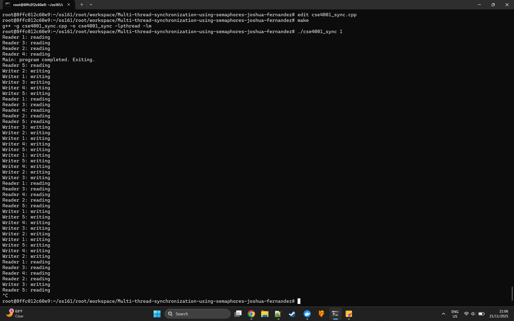
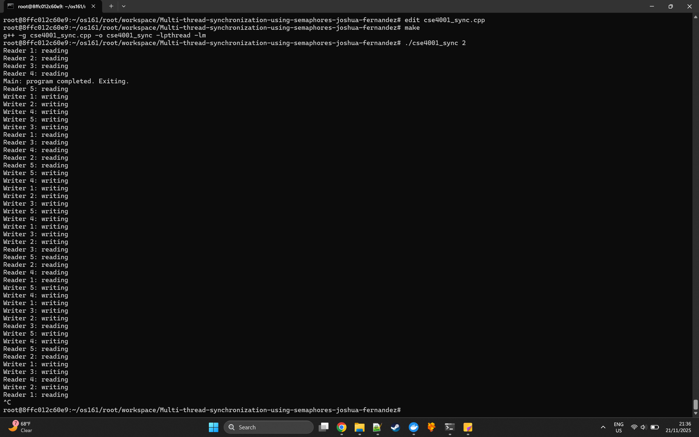
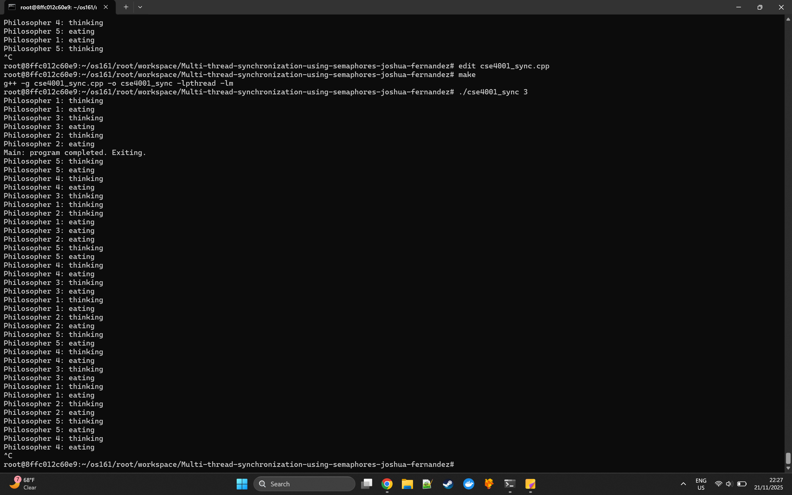
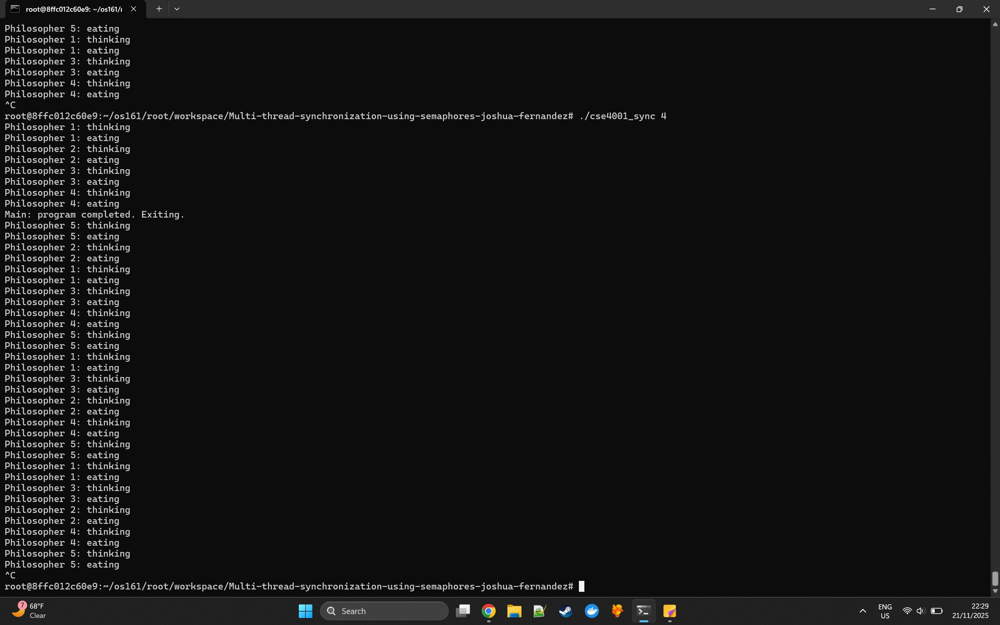

# Multi-thread-synchronization-using-semaphores-joshua-fernandez

No-Starve Readers Writers:
By having a lightswitch version of the semaphore, readers can enter the room and lock writers out until there are no more readers left. However, this can cause starvation for the writers. An extra semaphore, the "turnstile", is added to prevent new readers from entering if a writer wants to enter. This way the writer can go in once all the readers are out, and then open the turnstile again so more readers can enter.

Writers-Priority Readers Writers:
By giving the writers a lightswitch just like the readers, they can essentially "skip the line" and get ahead of all the other readers. As long as there are writers, more writers can keep coming in and out. Once all writers are done, then the readers can start entering. If a writer is queued up, then no more readers will be able to enter, but not vice versa. This results in writers having priority over the readers for access.

Dining Philosophers #1:
By having a "footman" at the table (in practice just another semaphore of 4), we can limit the amount of philosophers attempting to dine at once. If there are already 4 philosophers attempting to dine, the fifth philosopher is stopped by the semaphore, guaranteeing that one of its neighbors can proceed with their dining. This prevents starvation since all philosophers must eventually finish eating and allow the fifth philosopher to eat after them.

Dining Philosophers #2:
By making at least one philosopher a leftie, it is impossible to have a deadlock. If a deadlock starts occurring, the leftie would wait for its left fork instead of the right, stopping the circle of deadlock from happening and allowing its right neighbor to eat, preventing the deadlock entirely. In my case, I simply made the first philosopher a leftie and all the others righties.
